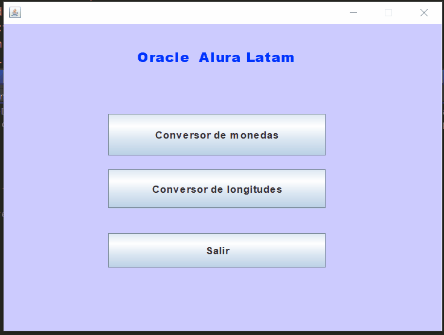

<h1 align="center">:currency_exchange: Conversor de Moneda ☕</h1>

En este desafio realicé un conversor de moneda, el conversor
obtiene los valores frente a las divisas extranjeras solicitadas.

La aplicación debe estar conectada a internet, ya que consume una API REST la cual es Exchange Rates Data API 

Incluye también un conversor de longitudes, este puede usarse sin conexión a internet.

**Tecnologías 💻:**

         - Interfaz gráfica desarrollada con Javax.Swing.
         - Maven para gestion de dependencias
         - Uso de Programación Orientada a Objetos.
         - Cálculos de conversión realizados y manejo de cifras monetarias con la clase BigDecimal.
  
  **API REST Consumidas : [exchangerate.host](https://exchangerate.host/#/)**
 

**Librerías 📖:**
   
   -  
   -  
   - 

**Demo:**

**Requisitos Proyecto:**

El convertidor de moneda debe:

           - Convertir de la moneda de tu país a Dólar
           - Convertir de la moneda de tu país  a Euros
           - Convertir de la moneda de tu país  a Libras Esterlinas
           - Convertir de la moneda de tu país  a Yen Japonés
           - Convertir de la moneda de tu país  a Won sul-coreano

Recordando que también debe ser posible convertir inversamente, es decir:

           - Convertir de Dólar a la moneda de tu país
           - Convertir de Euros a la moneda de tu país
           - Convertir de Libras Esterlinas a la moneda de tu país
           - Convertir de Yen Japonés a la moneda de tu país
           - Convertir de Won sul-coreano a la moneda de tu país
           
### Reconocimiento

- El desafío fue proporcionado por [Oracle + Alura Latam "ONE - Oracle Next Education"](https://www.aluracursos.com/challenges/oracle-one-java/sprint01-conversor-moneda)
